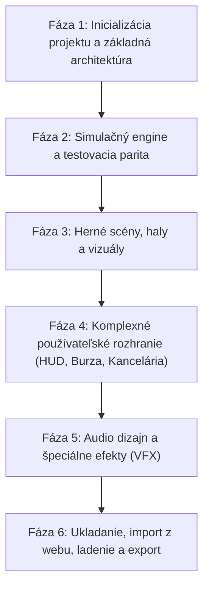

# Žeravá zlievareň — Godot 4 Migration Master Roadmap

Kompletný plán transformácie hry **Žeravá zlievareň** z webového prehliadača (Canvas + JavaScript) do herného enginu **Godot 4.7 (GDScript 2.0)**.

---

## 1. Vízia a ciele projektu

1. **100% zachovanie pravidiel a simulácie**:
   - Všetky existujúce herné mechaniky, matematické vzorce, časové intervaly (180 s = 1 deň), zmennosť (3 smeny, 2 majstri), personálny systém, burza, zákazky a pieskovač budú fungovať identicky ako v pôvodnom webovom engine (`dist/engine.js`).
2. **Plná kompatibilita uložených hier (Save Compatibility)**:
   - Podpora schémy uloženia (aktuálna verzia 14) s možnosťou importu a exportu existujúcich rozohraných pozícií z webového prehliadača (`localStorage`).
3. **Povýšenie vizuálnej a audiovizuálnej kvality**:
   - Prechod z 2D HTML Canvas na Godot 2D scénu s plynulými časticovými efektmi (720 iskier pri nepodarkoch, parné ventilácie, tlaková voda), dynamickým nasvietením (denný a nočný cyklus) a bohatým priemyselným zvukovým dizajnom (hučanie pece, roztáčanie odstrediviek, cinknutie mincí).
4. **Responzívne a intuitívne používateľské rozhranie**:
   - Moderné rozhranie postavené na Godot `Control` uzloch s témou zodpovedajúcou farebnej schéme hutníckeho závodu.
5. **Multiplatformová podpora**:
   - Primárne natívny desktop (Windows 64-bit .exe, Linux, macOS) s možnosťou exportu do Godot Web (HTML5/WebAssembly) pre pokračovanie na ChatGPT Sites.

---

## 2. Prehľad modulárnej dokumentácie plánu

Podrobný plán je rozdelený do špecializovaných dokumentov:

| Dokument | Zameranie a obsah |
| :--- | :--- |
| **[01. Architektúra a štruktúra projektu](./01_project_structure_and_architecture.md)** | Adresárová štruktúra Godot projektu, Autoload singletony, EventBus architektúra, dátové štruktúry |
| **[02. Simulačný engine a parita pravidiel](./02_simulation_engine_parity.md)** | Prepísanie `engine.js` do GDScriptu, determinizmus, vzorce miezd, dochádzky, burzy, zákaziek |
| **[03. Haly, scény a 2D vykresľovanie](./03_rooms_and_2d_rendering.md)** | Zlievaren, Sklad, Pieskovač, CNC, Kancelária; animácie, postavy, pojazdný záves s panvou |
| **[04. Používateľské rozhranie a HUD](./04_ui_and_hud_system.md)** | Horný HUD, inšpektory strojov, skladov a pieskovača, spodné panely, personálne okno Kancelárie |
| **[05. Zvukový dizajn a vizuálne efekty](./05_audio_and_vfx.md)** | Priemyselný ambient, zvukové efekty strojov, časticové systémy (iskry, para, voda), shadery žeravého kovu |
| **[06. Systém ukladania a migrácia](./06_save_system_and_migration.md)** | JSON perzistencia v `user://`, import/export existujúcich save-ov z webového prehliadača, migračné funkcie |
| **[07. Automatizované testovanie a verifikácia](./07_automated_testing_and_verification.md)** | Portovanie existujúcich 10 CJS testovacích sád do Godot headless runnera pre overenie 100% parity |

---

## 3. Fázový plán implementácie (Fázy 1 – 6)

### Fáza 1: Inicializácia projektu a základná architektúra
- Rozbalenie Godot 4.7.2 do pracovného prostredia.
- Vytvorenie `project.godot` s konfiguráciou rozlíšenia (1920×1080, stretch mode `canvas_items`, aspect `keep_width`/`expand`).
- Založenie priečinkovej štruktúry (`res://src/`, `res://assets/`, `res://tests/`).
- Nastavenie základných autoloadov (`EventBus.gd`, `GameManager.gd`, `SimulationClock.gd`, `SaveManager.gd`).

### Fáza 2: Simulačný engine a testovacia parita
- Portovanie dátových modelov: materiály, výrobky, recepty, technologické časy, teploty.
- Implementácia `FoundryEngine.gd` a pomocných simulačných modulov:
  - `SimulationClock`: krok 180 s/deň, počítadlo týždňov, zmeny (Miči, Maslo, Matino), majstri (Mišo, Miro).
  - `CastingSimulation`: odstredivky 1–6, obsluha, fronta panvy, nalievanie, chladenie, nepodarky.
  - `WasherSimulation`: pieskovač, vodné čistenie, náklady na vodu/energiu, automatický posuv.
  - `WarehouseSimulation`: príjmová rampa, zásobníky surovín, rozširovanie, palety odliatkov.
  - `MarketSimulation`: harmonické cenové vlny, denné udalosti, nákup/predaj, limitné pokyny.
  - `ContractSimulation`: generovanie ponúk, vzťahy a reputácia s odberateľmi, termíny prijatia a dodania.
  - `PersonnelSimulation`: uchádzači, algoritmus mzdy, dochádzka, absencie, nadčasy, odstupné, týždenná výplata.
- Vytvorenie headless testovacieho runnera a prepis všetkých 10 sád testov (`tests/*.cjs`). Spustenie a dosiahnutie 100% zelených testov.

### Fáza 3: Herné scény, haly a vizuály
- Vytvorenie scén jednotlivých hál:
  1. `FoundryHall`: pec s naklápaním, žeriavová dráha, pohyblivá panva s lankami a taveninou, 6 staníc odstrediviek, postavy robotníkov a hliadkujúci majster.
  2. `WarehouseHall`: rampa s bránou, vizuálne zásobníky surovín, palety výrobkov, skladník s vozíkom.
  3. `WasherHall`: uzavretá modrá komora pieskovača, posuv rúr sprava doľava, nádrž, tlakové čerpadlo.
  4. `CncHall`: linka CNC 1–6, zamknutá AMADA, programátorský stôl s monitorom a kreslom.
  5. `OfficeRoom`: reprezentácia kancelárie majstra a personálneho oddelenia.
- Prepojenie prepínania miestností cez `NavigationController`.

### Fáza 4: Používateľské rozhranie a HUD
- Vytvorenie centrálnej hernej témy (`res://assets/ui/foundry_theme.tres`): tlačidlá, panely, písmo, farebné akcenty.
- Implementácia hlavného HUD-u: zobrazenie financií (₵), tržieb, reputácie, hodín, zmennosti, majstra v službe, plnenia míľnikov.
- Bočný inšpektor podľa aktívnej haly (ovládanie odstredivky, skladu, pieskovača, CNC).
- Spodný manažérsky panel s tabmi:
  - **Sklady**: prehľad stavu zásobníkov a hotových odliatkov.
  - **Burza**: grafy cien, okamžitý nákup/predaj, limitné predajné príkazy.
  - **Zákazky**: ponuky firiem, aktívne kontrakty, odpočítavanie termínov.
  - **Rozvoj**: odomykanie nových výrobkov, zrýchlenie pojazdného závesu, zväčšenie skladov.
  - **Kancelária**: nábor uchádzačov, riešenie absencií, volanie nadčasov, mzdové účtovníctvo, prepúšťanie.

### Fáza 5: Zvukový dizajn a vizuálne efekty (VFX)
- Vytvorenie a naladenie časticových systémov:
  - 720 úlomkov a balistických iskier pri havárii/nepodarku rúry.
  - Parné oblaky unikajúce z ventilačných mriežok pri chladení vodou.
  - Trysky tlakovej vody v pieskovači.
  - Dym a žeravé emisie z pece.
- Nasadenie shaderov:
  - Žeravenie kovu podľa teploty (20 °C až 1700 °C).
  - Deň/noc atmosféra a osvetlenie okien/svetlíkov.
- Implementácia zvukového systému:
  - `AudioManager` s viacerými zvukovými zbernicami (Master, SFX, Ambient, UI).
  - Syntetizované a procedurálne zvuky motorov, sirény, cinknutia mincí a priemyselného ruchu.

### Fáza 6: Ukladanie, import z webu, ladenie a export
- Implementácia ukladania a načítavania do `user://savegame.json`.
- Dialóg na import rozohraných pozícií: hráč môže vložiť existujúci JSON reťazec z webového `localStorage` a plynulo pokračovať v rozohratej hre.
- Export pre Windows (.exe) a Web (HTML5/WASM).
- Overenie výkonu a bezchybnosti.
