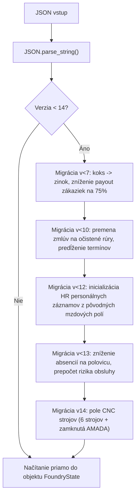

# 06. Systém ukladania a migrácia dát (Save & Migration)

Tento dokument špecifikuje ukladanie stavu hry, spätnú kompatibilitu so všetkými verziami pôvodného webového projektu (schémy v1 až v14) a most na prenos uložených hier medzi webovým prehliadačom a Godotom.

---

## 1. Úložisko a formát údajov

- **Umiestnenie súboru v Godote**: `user://savegame.json` (automaticky mapované na `%APPDATA%\Godot\app_userdata\Zlievaren` vo Windows).
- **Formát**: Čitateľný JSON formát identický so štruktúrou webového kľúča `zerava-zlievaren-v1` v `localStorage`.
- **Aktuálna verzia schémy**: `14`.

---

## 2. Most medzi webom a desktopom (Import / Export)

Pre splnenie kľúčovej požiadavky na zachovanie rozohraných pozícií implementujeme dve cesty:

### 2.1 WebAssembly / HTML5 export (`JavaScriptBridge`)
Pri spustení hry ako Godot Web export v prehliadači dokáže Godot priamo komunikovať s `localStorage`:

```gdscript
class_name WebStorageBridge
extends RefCounted

const STORAGE_KEY: String = "zerava-zlievaren-v1"

static func load_from_browser() -> String:
    if OS.has_feature("web"):
        var js_code: String = "localStorage.getItem('%s') || ''" % STORAGE_KEY
        var result: Variant = JavaScriptBridge.eval(js_code)
        if result is String and not result.is_empty():
            return result
    return ""

static func save_to_browser(json_data: String) -> void:
    if OS.has_feature("web"):
        # Escapovanie reťazca pre JavaScript eval
        var safe_json: String = json_data.c_escape()
        var js_code: String = "localStorage.setItem('%s', \"%s\")" % [STORAGE_KEY, safe_json]
        JavaScriptBridge.eval(js_code)
```

### 2.2 Natívny desktopový import / export dialóg
V desktopovej verzii (Windows `.exe`) pridáme do hlavného menu dialóg:
- **Import z webu**: Hráč vloží skopírovaný JSON text z pôvodného webu (alebo načíta súbor) $\to$ hra overí validitu, aplikuje migráciu a načíta pozíciu.
- **Export pre web**: Hráč jedným kliknutím vygeneruje a skopíruje JSON stav do schránky (clipboard), ktorý môže vložiť do konzoly prehliadača.

---

## 3. Migračná logika (v1 až v14)

Funkcia `restore(raw_json)` v `SaveManager.gd` plne replikuje overovaciu a migračnú logiku z `dist/engine.js`:



### Kľúčové migračné pravidlá:
1. **Verzie < 7**: Premenovanie suroviny `coke` na `zinc` (zásobníky, rampa, sklad). Výplaty kontraktov prepočítané na 75 %.
2. **Verzie < 10**: Všetky zákazky na neočistené rúry automaticky požadujú očistené výrobky (`clean_iron_pipe`, `clean_steel_pipe`). Rozpracované zákazky získavajú minimálnu lehotu 135 sekúnd.
3. **Verzie < 12**: Zavedenie Kancelárie a personálnych záznamov (`state.hr`). Existujúci pracovníci (Miči, Maslo, Matino, majstri Mišo a Miro) sú prenesení bez straty zarobenej mzdy.
4. **Verzie < 13**: Hodnoty absencií znížené na polovicu. Riziko nepodarku obsluhy sa sčítava s rizikom stroja.
5. **Verzie 14**: Inicializácia 7 CNC stanovišť (`cncOwned`, `cncPower`), pričom slot 6 (AMADA) je striktne zamknutý.

---

## 4. Bezpečnosť a integrita dát

- Všetky numerické polia sa overujú na konečnosť (`is_finite()`) a rozsah (`clamp()`).
- Zákazky s neplatným odberateľom alebo neznámym produktom sú bezpečne odfiltrované.
- V prípade poškodeného súboru systém vytvorí záložnú kópiu `savegame.corrupt.<timestamp>.json` a inicializuje novú čistú hru (`FoundryEngine.fresh()`), aby hra nikdy nespadla.
